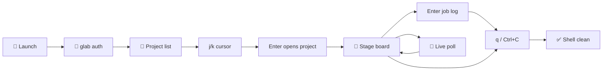

# 🚀 ciview

[](doc/arch/)
[](https://bun.sh)
[](https://opentui.com)
[](https://docs.gitlab.com/ee/ci/)
[](https://github.com/farchanjo/ciview/releases)

**Your GitLab CI, right in the terminal.**  
No more tab tennis between the browser, `glab`, and “which job failed again?”

**ciview** is a small keyboard-first cockpit for **pipelines, jobs, and logs** — nothing else.  
Think of it as a friendly, live **CI board** that lives next to your shell.

> ✨ Spec-driven: behaviour is defined under [`doc/arch/`](doc/arch/).  
> Code lives in [`src/ciview/`](src/ciview/).

## Index

- [Why](#why)
- [Features](#features)
- [Quick start](#quick-start)
- [Keys](#keys)
- [Flow](#flow)
- [Stack](#stack)
- [Releases](#releases)
- [Develop](#develop)
- [Specs](#specs)
- [Contributing](#contributing)
- [FAQ](#faq)

---

## Why

GitLab CI is great — but *watching* a build usually means:

- 🌐 opening three browser tabs  
- ⌨️ juggling CLI subcommands  
- 😵 losing the failed job name in the noise  

**ciview** keeps you in one place:

| Zone | What you see |
|------|----------------|
| 📂 **Left** | Projects (pins, recent, filter) |
| 🧱 **Right** | Pipeline strip + **stage board** (jobs by stage) |
| 📜 **Drawer** | Job log — only when you open a job |

Cursor moves with `j`/`k`. **Enter** opens. Logs don’t spam the screen until you ask.

---

## Features

- 📂 **Project sidebar** — smart / pinned / all, filter, pins, recent  
- 🧱 **Stage board** — columns = stages, cells = jobs (status + duration)  
- 📜 **Log on demand** — Enter on a job; Esc closes; follow with `f`  
- ⌨️ **Keyboard-first** — press **`?`** anytime for the full cheat sheet  
- 🔴 **Live updates** — while LIVE is on and a project is open, new pipelines appear  
- 🔐 **Auth via [glab](https://gitlab.com/gitlab-org/cli) only** — no pasting PATs into random env files  
- 🌍 Open the focused pipeline/job in the browser with `o`  
- 🧹 **Clean quit** — `q` or Ctrl+C leaves your shell usable  

**Not in MVP** (on purpose): issues, merge requests, source browser, registry, retry/cancel.  
This is a **CI-only** tool — see the [constitution](doc/arch/memory/constitution.md).

---

## Quick start

### 1) Talk to GitLab with glab

```bash
# macOS
brew install glab

glab auth login          # gitlab.com or your self-hosted host
glab auth status         # sanity check
```

ciview **only** reads credentials from glab.  
If glab is missing or not logged in, it exits with a clear **“do this next”** message (exit code `2`).

### 2) Install ciview

**Option A — binary from GitHub Releases** (easiest):

```bash
# macOS Apple Silicon example — pick the asset for your OS from the latest release
# https://github.com/farchanjo/ciview/releases

chmod +x ciview-darwin-arm64
sudo mv ciview-darwin-arm64 /usr/local/bin/ciview
ciview -h
```

**Option B — from source** (needs [Bun](https://bun.sh)):

```bash
git clone https://github.com/farchanjo/ciview.git
cd ciview
bun install
bun run start            # or: make deploy  → /usr/local/bin/ciview (macOS)
```

### 3) Fly

```bash
ciview                   # dashboard
ciview .                 # focus project from git remote
ciview group/my-project  # focus by path
```

Press **`?`** inside the app for shortcuts.  
Quit with **`q`** or **Ctrl+C** (shell-safe).

---

## Keys

| Key | Action |
|-----|--------|
| `?` | Help |
| `j` / `k` | Move cursor (projects or board) — **does not open** |
| `Enter` | Open project → open job log (or dive into a child pipeline) |
| `h` / `l` | Move across stages |
| `/` | Filter projects |
| `m` | Scope: smart → pinned → all |
| `p` | Pin / unpin |
| `r` / `R` | Refresh / toggle LIVE |
| `o` | Open in browser |
| `s` `[` `]` | Sidebar show/hide |
| `f` | Toggle log follow |
| `Esc` | Close log / go back |
| `q` | Quit |

Full map:  
[`keybindings.md` (feature 001)](doc/arch/sdd/001-gitlab-ci-tui-cockpit-with-project-sidebar-pipeline-and-job/keybindings.md) ·  
[`keybindings.md` (feature 002)](doc/arch/sdd/002-keep-project-sidebar-right-side-is-a-navigable-pipeline/keybindings.md)

---

## Flow



More detail: [`product-overview.md`](doc/arch/functional/product-overview.md).

---

## Stack

| Piece | Choice |
|-------|--------|
| Runtime | [Bun](https://bun.sh) |
| Language | TypeScript |
| UI | [OpenTUI](https://opentui.com) + React |
| Work queue | `p-queue` (concurrency 4; your keys beat background poll) |
| API | GitLab REST v4 (read-only MVP) |
| Specs | [speckit](https://github.com/) corpus in `doc/arch/` |

Architecture notes: [ADR-0002 async queue](doc/arch/adr/0002-async-workers-queue-observer-bun.md) · [ADR-0003 React OpenTUI](doc/arch/adr/0003-react-opentui-typescript-stack.md) · [ADR-0004 board UX](doc/arch/adr/0004-keep-project-sidebar-right-side-is-a-navigable-pipeline.md).

---

## Releases

Binaries are built **on a real Mac** and **on a Linux machine over SSH** — not in GitHub CI  
([why](.github/CI_DISABLED.md)).

| Asset | Built on |
|-------|----------|
| `ciview-darwin-arm64` (or x64) | Developer Mac |
| `ciview-linux-x64` | Linux builder (`root@vm.services` by default) |

Maintainers (one command):

```bash
make ship              # bump patch + tests + binaries + tag + GitHub Release
make ship PART=minor
```

See [AGENTS.md](AGENTS.md) and the [Makefile](Makefile).

---

## Develop

```bash
bun install
make hooks-install     # local git hooks (recommended once per clone)
bun run start
bun test
bun run typecheck
make check             # tests + types + lint + speckit validate
```

Hooks block secrets, keep Conventional Commits, and run checks on push.  
Skip once with `SKIP_HOOKS=1` if you must.

---

## Specs

This project is **spec-first**: change the corpus under `doc/arch/`, then code.

| Doc | Why open it |
|-----|-------------|
| [Constitution](doc/arch/memory/constitution.md) | Product principles (CI-only, glab, shell-safe exit…) |
| [Product overview](doc/arch/functional/product-overview.md) | Story of the product |
| [Feature 001 spec](doc/arch/sdd/001-gitlab-ci-tui-cockpit-with-project-sidebar-pipeline-and-job/spec.md) | Core cockpit FRs |
| [Feature 002 spec](doc/arch/sdd/002-keep-project-sidebar-right-side-is-a-navigable-pipeline/spec.md) | Board + stable sidebar |
| [UX layout](doc/arch/sdd/002-keep-project-sidebar-right-side-is-a-navigable-pipeline/ux-layout.md) | What each zone does |
| [AGENTS.md](AGENTS.md) | Map for humans *and* AI agents |

```bash
speckit status
speckit validate    # must stay clean when you touch the corpus
```

---

## Contributing

1. Read the [constitution](doc/arch/memory/constitution.md) and the active feature under `doc/arch/sdd/`.  
2. Prefer **spec → code** (`speckit` workflow).  
3. Keep the product **CI-only**, auth **glab-only**, and commits **Conventional**.  
4. Don’t add GitHub Actions build workflows unless the project explicitly re-enables them.

---

## FAQ

**Does it replace the GitLab UI?**  
No — it replaces the *tab chaos* for day-to-day CI watching. Open the browser with `o` when you need the full UI.

**Can I put a token in `.env`?**  
Not as the primary path. Use `glab auth login`. That keeps secrets out of the repo and out of random shell history.

**Will Ctrl+C trash my terminal?**  
It shouldn’t. Quit is designed to restore the shell (see FR-27 / [shutdown-flow](doc/arch/sdd/001-gitlab-ci-tui-cockpit-with-project-sidebar-pipeline-and-job/shutdown-flow.md)). If something ancient is stuck, run `reset`.

**Linux binary from my Mac?**  
Build Linux on a Linux host (`make build-linux` / `make ship`). OpenTUI has native bits — no fake cross-compile.

---

## License

Not set yet — will be declared before a broader public packaging push.  
Until then, treat the repo as source-available for evaluation.

---

Made for people who live in the terminal and still care about green pipelines. 💚  
Happy shipping!
