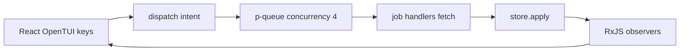

# :rocket: ciview

[](doc/arch/)
[](https://bun.sh)
[](https://opentui.com)
[](https://docs.gitlab.com/ee/ci/)

**ciview** is a terminal CI cockpit for GitLab: a multi-pane OpenTUI navigator
for **projects → pipelines → jobs → logs**. Think of it as a turbinated
`glab ci` / pipeline view — keyboard-first, live while builds run, **CI only**.

> Status: **MVP implemented** under [`src/ciview/`](src/ciview/).  
> Specs and ADRs live under [`doc/arch/`](doc/arch/).

## :books: Index

- [Why](#why)
- [Features (planned MVP)](#features-planned-mvp)
- [Architecture](#architecture)
- [Stack](#stack)
- [Repository layout](#repository-layout)
- [Run](#run)
- [Specs](#specs)
- [Auth](#auth-planned)
- [Documentation](#documentation)
- [Contributing](#contributing)

## :compass: Why

GitLab CI is powerful, but watching it “happen” means jumping between browser
pages and CLI subcommands. **ciview** keeps you in the terminal with:

- a **left project sidebar** (pins + CI pulse)
- **pipelines** and **jobs by stage** with clear status glyphs
- **job log tail** while a build is running
- **live poll** only when something is active (async, non-blocking)

## :sparkles: Features (planned MVP)

- **Project sidebar** (smart/pinned/all, filter) — `j/k` cursor only, **Enter opens**
- **Pipeline stage board** on the right (strip + columns per stage)
- **Job log on demand** (Enter on job; Esc closes)
- **Shortcut-first** UX with in-app **Help (`?`)**
- See feature 002: [`ux-layout.md`](doc/arch/sdd/002-keep-project-sidebar-right-side-is-a-navigable-pipeline/ux-layout.md)
- Read-only GitLab REST API v4 (no retry/cancel in MVP)
- Auth **only via [glab](https://gitlab.com/gitlab-org/cli)** (install + `glab auth login` if missing)
- Focus modes: dashboard, current git remote (`.`), `group/project` path
- Open focused pipeline/job in the browser

Out of scope for MVP: issues, MR editing, source browser, registry, runner admin.

## :gear: Architecture

Async-first on **Bun** ([ADR-0002](doc/arch/adr/0002-async-workers-queue-observer-bun.md)):



```text
UI keys (React)  →  p-queue.add(job)  →  up to 4 concurrent handlers  →  store.apply
                                                                            ↓
                                                              RxJS/observers → redraw
```

- **Interactive realtime CLI** — long-lived TUI; keys always live; screen follows stores
- **Store map** — session, prefs, projects, pipelines, jobs, trace, selection, uiChrome ([`store-map.md`](doc/arch/sdd/001-gitlab-ci-tui-cockpit-with-project-sidebar-pipeline-and-job/store-map.md))
- **Queue** — [`p-queue`](https://github.com/sindresorhus/p-queue), **concurrency 4**
- **Priority** — **user jobs always ahead of poll**
- **Observers** — React TUI reacts to store / **RxJS**; handlers never paint
- **No OS Worker threads** in MVP (async slots on Bun’s event loop only)

## :wrench: Stack

| Layer | Choice |
|-------|--------|
| Runtime | [Bun](https://bun.sh) |
| Language | TypeScript only |
| TUI | [OpenTUI](https://opentui.com) + **React** |
| Queue | `p-queue` (concurrency 4) |
| Reactive | RxJS (allowed / preferred for streams) |
| API | GitLab REST v4 |
| Auth | glab only |
| Specs | [speckit](https://github.com/) / `doc/arch` |

## :file_folder: Repository layout

```text
doc/arch/           # source of truth (constitution, specs, ADRs, tasks)
src/ciview/         # Bun + OpenTUI React implementation
  main.tsx          # entry
  runtime/          # p-queue, handlers, effects
  state/            # store map
  ui/               # React panes + Help overlay
  gitlab/ auth/ …
```

## :hammer_and_wrench: Run

```bash
bun install
bun run start              # interactive TUI
bun run src/ciview/main.tsx .
bun run src/ciview/main.tsx group/project
bun test && bun run typecheck
make deploy                # local binary → /usr/local/bin (macOS codesign)
```

Auth is **glab only**. If glab is missing or not logged in, ciview prints:

```text
1) Install glab:   brew install glab
2) Authenticate:   glab auth login && glab auth status
```

In the TUI: press **`?`** for the shortcut help overlay.

## :package: Release binaries (local only — no GitHub Actions)

**CI on GitHub is disabled.** Prefer one command:

```bash
make ship                 # bump patch + check + binaries + tag + push + gh release
make ship PART=minor
make ship PART=1.2.0
```

| Artifact | Builder |
|----------|---------|
| `ciview-darwin-arm64` (or x64) | This Mac |
| `ciview-linux-x64` | `ssh root@vm.services` (native OpenTUI) |

Piecewise: `make release-binaries` then `make release`.  
Docs: [AGENTS.md](AGENTS.md), [`.github/CI_DISABLED.md`](.github/CI_DISABLED.md), Makefile.

## Specs

This repo is **spec-driven**:

```bash
speckit status
speckit next
speckit validate   # must be 0 findings before commits that touch the corpus
```

Feature **001** is implemented under `src/ciview/`.

Key docs:

| Doc | Path |
|-----|------|
| Constitution | [`doc/arch/memory/constitution.md`](doc/arch/memory/constitution.md) |
| Product overview | [`doc/arch/functional/product-overview.md`](doc/arch/functional/product-overview.md) |
| Feature spec | [`doc/arch/sdd/001-gitlab-ci-tui-cockpit-with-project-sidebar-pipeline-and-job/spec.md`](doc/arch/sdd/001-gitlab-ci-tui-cockpit-with-project-sidebar-pipeline-and-job/spec.md) |
| Plan | [`doc/arch/sdd/001-gitlab-ci-tui-cockpit-with-project-sidebar-pipeline-and-job/plan.md`](doc/arch/sdd/001-gitlab-ci-tui-cockpit-with-project-sidebar-pipeline-and-job/plan.md) |
| Tasks | [`doc/arch/sdd/001-gitlab-ci-tui-cockpit-with-project-sidebar-pipeline-and-job/tasks.md`](doc/arch/sdd/001-gitlab-ci-tui-cockpit-with-project-sidebar-pipeline-and-job/tasks.md) |
| ADR Bun+OpenTUI | [`doc/arch/adr/0001-….md`](doc/arch/adr/0001-gitlab-ci-tui-cockpit-with-project-sidebar-pipeline-and-job.md) |
| ADR async runtime | [`doc/arch/adr/0002-async-workers-queue-observer-bun.md`](doc/arch/adr/0002-async-workers-queue-observer-bun.md) |
| ADR React UI | [`doc/arch/adr/0003-react-opentui-typescript-stack.md`](doc/arch/adr/0003-react-opentui-typescript-stack.md) |

## :key: Auth (glab only)

```bash
# 1) Install (if needed)
brew install glab

# 2) Authenticate
glab auth login
# self-hosted:
# glab auth login --hostname git.example.com

glab auth status
```

ciview never asks you to paste a PAT into env for normal use — it reads the
token glab already stored.

## :open_book: Documentation

- [`AGENTS.md`](AGENTS.md) — map for AI agents / automation  
- [`doc/arch/`](doc/arch/) — full spec corpus  

## :handshake: Contributing

1. Read the constitution and the active feature spec under `doc/arch/`.  
2. Prefer changing specs first, then code (`speckit` workflow).  
3. Keep the product **CI-only** and the runtime **async queue/observer** based.  

## License

License not set yet — will be declared via project metadata before the first
runtime release.
