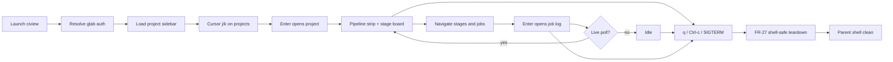

# ciview — Product Overview

Functional documentation for ciview, written from the user's point of view:
what the product does, who uses it, how the main flow runs, and how we know it
works. Keep this in sync with the executable specs under
`doc/arch/specs/features/`.

## Overview

**ciview** is a terminal CI cockpit for GitLab (self-hosted or gitlab.com). It
lets a developer or operator navigate projects, pipelines, stages, jobs, and
build logs with a clear multi-pane OpenTUI interface — a turbinated
`glab ci` / pipeline view focused only on CI.

Problem: GitLab CI status is fragmented across browser pages and CLI
subcommands; watching a build “happen” and jumping project → pipeline → job →
log is slow.

Outcome: one keyboard-driven TUI session with a **project sidebar** and a
**pipeline stage board** on the right; job logs open only on demand as a
**smart full-viewport modal** (features 002–003). Geometry scales with terminal
size via a pure layout budget. Live poll updates the board without thrash.

## Actors

- **Developer** — works in repos; wants branch/pipeline status, failed job logs,
  and live progress without leaving the terminal.
- **Operator / infra engineer** — watches multiple projects (e.g. `infra/*`);
  pins favorites; opens web UI only when needed.
- **GitLab** — external system exposing REST API v4 (pipelines, jobs, trace).
- **glab (local)** — optional credential/host source already configured on the
  machine (not a runtime dependency of the TUI loop beyond auth bootstrap).

## Main Flow

Primary end-to-end flow:

### Interaction model (target UX — feature 002)

1. **Projects** (left sidebar) — smart/pinned/all, filter, pins, recent;
   **j/k = cursor only**; **Enter = open project**.
2. **Pipeline graph** (right) — pipeline strip + **stage board** (columns =
   stages, cells = jobs). Navigate without opening logs.
3. **Job log modal** — only after Enter on a job; smart/errors/all modes;
   Esc closes. Overlay does not reflow the board (ADR-0005 / feature 003).
4. **Exit** — `q` / Ctrl+c / SIGTERM: ordered FR-27 teardown so the **shell
   does not break** (see `shutdown-flow.md`).

Auth is **glab only**. See
`doc/arch/sdd/002-keep-project-sidebar-right-side-is-a-navigable-pipeline/ux-layout.md`,
`doc/arch/sdd/003-adaptive-terminal-layout-smart-job-log-modal-1-compute-all/ux-layout.md`,
ADR-0004, and ADR-0005.

## CLI entry points (product)

| Invocation | Initial focus |
|---|---|
| `ciview` | Dashboard: sidebar + last/pinned project CI |
| `ciview .` | Project from current git remote |
| `ciview <path/with/namespace>` | Named project |
| `ciview watch` | Live focus on running pipeline for current branch (when specified) |

Exact flags are fixed in feature specs; this table is the product intent.

## Acceptance

Acceptance criteria are executable under `doc/arch/specs/features/`.

- Every user-visible CI navigation behavior has a matching feature scenario.
- Changes to Main Flow start as spec changes, then implementation.
- `speckit verify` / feature corpus gates the product behavior as it is added.
- MVP acceptance themes:
  - Auth resolves from env or glab config
  - User can navigate project → pipeline → job → log
  - Status is visually scannable (success/failed/running/pending)
  - Live poll while CI is active
  - No CI write actions in MVP

## Observability

How we see ciview working:

- **Logs** — structured stderr/file logs for API errors, auth failure class
  (never token values), poll cycle summaries at debug level.
- **Metrics** (optional later) — API latency, poll interval, error counts.
- **Tracing** — not required for local TUI MVP; document if added later.

Full conventions: `doc/arch/observability/observability.md`.

## Constraints (from constitution)

- CI-only product surface
- Bun + OpenTUI + GitLab REST
- Read-mostly MVP
- Lazy load + smart poll
- Secrets never in the repository
